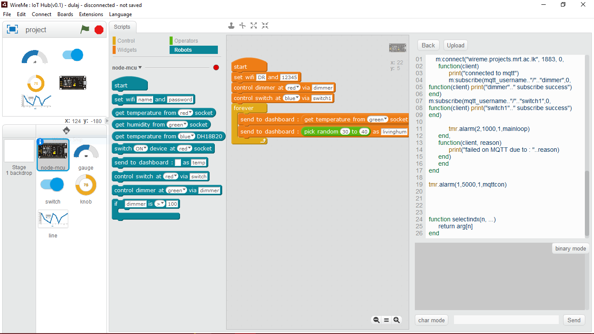

Team WireMe : IoT Hub
===================
---
> This is a Scratch based Visual programming tool which facilitate users to program NodeMcu Based devices as well as Deploy a web interface using Sprites of the visual programming interface

IoT Dashboard
=============
Register and login at: http://wireme.projects.mrt.ac.lk/login

IoT Hub
=======
Windows Download Link : https://goo.gl/ASRPec

Screenshot
==========

ToDo
====
 - Make widget configuration in one place.
 - Move functions to another lua file.
 - Add examples to main menu
 - dropdowns to topics in widgets (done in wireme json)

Bugs
====